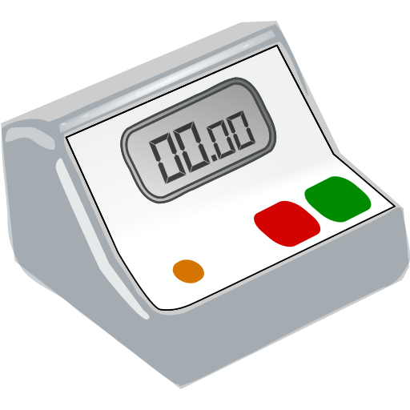
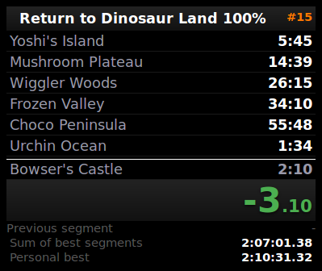
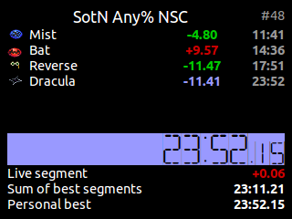

# LAST  Linux Auto Splitting Timer

LAST brings auto splitting functionality to [urn](https://github.com/3snowp7im/urn) with Lua-based auto splitters that are easy to port from asl.

 

## Features

- **Split Tracking and Timing:** Accurately track and time your speedruns with ease.
- **Auto Splitter Support:** Utilize Lua-based auto splitters to automate split timing based on in-game events.
- **Customizable Themes:** Personalize your timer's appearance by creating and applying custom themes.
- **Flexible Configuration:** Configure keybindings and various settings to suit your preferences.

## Dependencies

LAST requires the following dependencies on your system to compile and install:

- `libgtk+-3.0`
- `x11`
- `libjansson`
- `curl`
- `lua`
- `imagemagick`
- `rsync`

## Installation

1. `git clone https://github.com/Wins1ey/LAST`
2. `cd LAST`
3. Build LAST: `make`
4. Install LAST: `sudo make install`

## Getting Started

1. When first launched, LAST will create the `.last/` directory in your home directory. Auto splitters, splits and themes go in their respective folders inside.
2. Launch LAST by executing the compiled binary. `./bin/LAST`
3. The initial window is undecorated, but you can toggle window decorations by pressing the right Control key.
4. Control the timer using the following key presses:

   | Key        | Stopped Action | Started Action |
   |------------|----------------|----------------|
   | Spacebar   | Start          | Split          |
   | Backspace  | Reset          | Stop           |
   | Delete     | Cancel         | -              |

- The "Cancel" action resets the timer and decrements the attempt counter. A run reset before the start delay is automatically cancelled.
- To manually modify the current split, use the following key actions:

   | Key         | Action        |
   |-------------|---------------|
   | Page Up     | Unsplit       |
   | Page Down   | Skip split    |

4. Customize keybindings by setting the values in `wildmouse.last` path with `gsettings`.

   | Key                        | Type    | Description                       |
   |----------------------------|---------|-----------------------------------|
   | start-decorated            | Boolean | Start with window decorations     |
   | hide-cursor                | Boolean | Hide cursor in window             |
   | global-hotkeys             | Boolean | Enables global hotkeys            |
   | theme                      | String  | Default theme name                |
   | theme-variant              | String  | Default theme variant             |
   | keybind-start-split        | String  | Start/split keybind               |
   | keybind-stop-reset         | String  | Stop/Reset keybind                |
   | keybind-cancel             | String  | Cancel keybind                    |
   | keybind-unsplit            | String  | Unsplit keybind                   |
   | keybind-skip-split         | String  | Skip split keybind                |
   | keybind-toggle-decorations | String  | Toggle window decorations keybind |

Keybind strings should be parseable by
[gtk_accelerator_parse](https://developer.gnome.org/gtk3/stable/gtk3-Keyboard-Accelerators.html#gtk-accelerator-parse).

## Auto Splitters

LAST supports auto splitters written in Lua to automate split timing based on in-game events. When running LAST in the terminal you will initally be greeted with an auto splitter downloader which grabs them from [here](https://github.com/Wins1ey/LuaAutoSplitters). Feel free to make your own, documentation will be made soon.

## Split Files

Split files in LAST are stored as well-formed JSON. The split file must contain a main object. The following keys are optional:

| Key           | Value                                 |
|---------------|---------------------------------------|
| title         | Title string at top of window         |
| start_delay   | Non-negative delay until timer starts |
| world_record  | Best known time                       |
| splits        | Array of split objects                |
| theme         | Window theme                          |
| theme_variant | Window theme variant                  |
| width         | Window width                          |
| height        | Window height                         |

Each split object within the `splits` array has the following keys:

| Key          | Value                  |
|--------------|------------------------|
| title        | Split title            |
| time         | Split time             |
| best_time    | Your best split time   |
| best_segment | Your best segment time |

Times are strings in HH:MM:SS.mmmmmm format

## Themes

LAST supports customizable themes, allowing you to personalize the timer's appearance. To create a theme:

1. Create a CSS stylesheet with your desired styles.
2. Place the stylesheet in the `~/.urn/themes/<name>/<name>.css` directory.
3. Set the global theme by modifying the `theme` value in `gsettings`.
4. Theme variants should follow the pattern `<name>-<variant>.css`.
5. Individual splits can apply their own themes by specifying a `theme` key in the main split object.

For a list of supported CSS properties, refer to the [GtkCssProvider](https://developer.gnome.org/gtk3/stable/GtkCssProvider.html) documentation.

## CSS Classes

The following CSS classes can be used to style the elements of the LAST interface:

```css
.window
.header
.title
.attempt-count
.time
.delta
.timer
.timer-seconds
.timer-millis
.delay
.splits
.split
.current-split
.split-title
.split-time
.split-delta
.split-last
.done
.behind
.losing
.best-segment
.best-split
.footer
.prev-segment-label
.prev-segment
.sum-of-bests-label
.sum-of-bests
.personal-best-label
.personal-best
.world-record-label
.world-record
